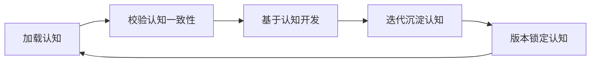

# 认知资产总览图谱（tk_freight）

## 1. 认知体系整体结构

本项目 AI 认知由六层认知资产 + 版本基线构成：

1. **架构认知**：`architecture/`
2. **业务认知**：`business/`
3. **历史认知**：`history/`
4. **约束认知**：`constraints/`
5. **认知控制规则**：`cognition/`
6. **运行治理资产**：`governance/`
7. **版本基线**：`context_version.yaml`

## 2. 资产目录清单

| 目录/文件 | 说明 |
|---|---|
| `README.md` | 上下文入口 |
| `context_version.yaml` | 版本基线 |
| `architecture/odoo_version.md` | Odoo 版本与项目基线 |
| `architecture/module_map.md` | 模块结构、单据层次、分层约束 |
| `architecture/dependency.yaml` | 模块依赖、模型调用图、方向约束 |
| `business/freight_rule.md` | 业务铁律与已确认口径 |
| `business/finance_flow.md` | 财务单据流与核算口径 |
| `business/business_debt_register.md` | 业务技术债摘要 |
| `business/knowledge_classification.md` | 事实/推测/未知知识分类 |
| `business/export_freight_coverage.md` | 现有功能 vs 出口货代业务覆盖矩阵 |
| `history/decision_note.md` | 架构与业务决策记录 |
| `history/bug_record.md` | Bug 记录 |
| `history/sprint_log.md` | 迭代日志 |
| `history/sprint_snapshot.md` | 迭代快照 |
| `constraints/forbidden_change.yaml` | 禁止变更清单 |
| `cognition/cognition_rule.yaml` | 认知强制加载规则 |
| `cognition/cognition_consistency_check.yaml` | 认知一致性校验 |
| `cognition/cognition_refresh.yaml` | 认知刷新与沉淀 |
| `cognition/context_readiness_review.md` | 独立验收与修复记录 |
| `governance/*.yaml` | 治理、风险、审计、工具、Bug 工作流 |
| `governance/test_lessons.yaml` | 跨迭代教训 |
| `governance/check_view_fields.py` | View-Model 字段交叉校验（tk_freight 自有模型） |
| `intent/intent_contract.template.yaml` | 意图契约模板 v3.0 |
| `intent/intent_sprint*.yaml` | 历史意图契约 |
| `intent_records/intent_xxx/` | Intent 执行记录 |
| `profiles/*.yaml` | Work Type 加载画像 |
| `validation/test_exec_records.yaml` | 测试执行台账 |
| `prompt_template.md` | AI Agent 启动提示词模板 |

## 3. 可执行引擎

位于 `execution/scripts/`：

| 引擎 | 职责 |
|---|---|
| `context_loader.py` | 开发前认知加载 + 基线校验 + 风险注入 |
| `verify.py` | 产出语法门禁（Python/XML/Odoo19 兼容等） |
| `commit_guard.py` | 提交守卫（不自动 add、不默认 push） |
| `odoo_check.py` | 模块升级加载检查 |
| `test_runner.py` | Odoo 测试执行器 |

## 4. 认知执行闭环

## 5. Intent 分类管理体系

- Work Type：Development / Maintenance / Infrastructure / Governance
- Change Type：New Feature / Change Request / Functional Bug Fix / Data Correction / Configuration Change / Performance Optimization / Legacy Migration / Architecture Upgrade / Compliance Review / Risk Audit
- 每个 Work Type 配套 `profiles/{work_type}.yaml`
- Intent 执行记录归档至 `intent_records/intent_xxx/`
